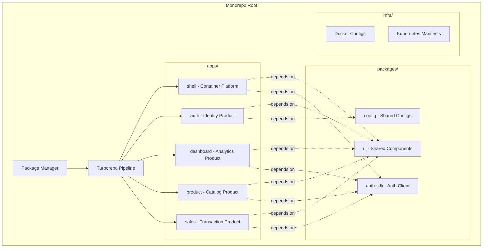
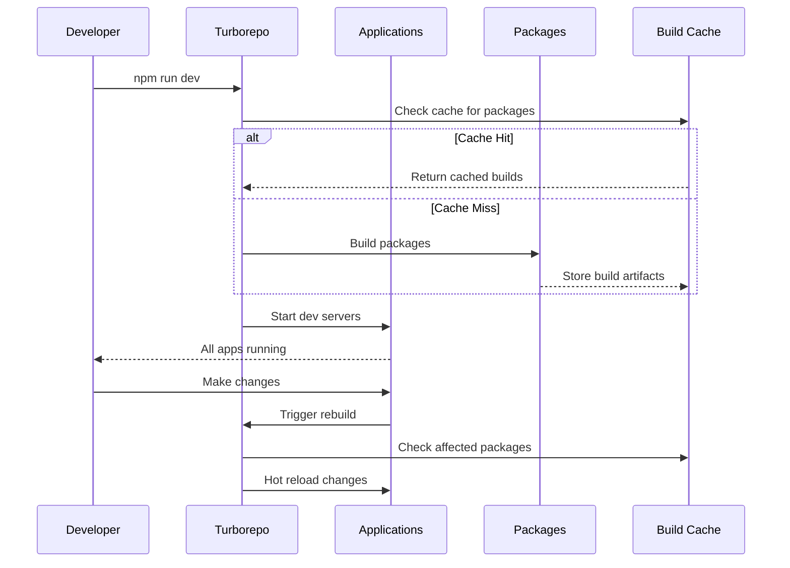
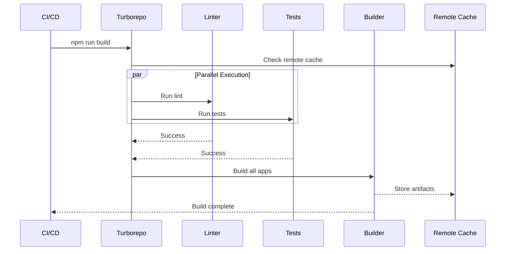

# Design Document: Turborepo Monorepo Setup

## Overview

This design establishes a production-grade monorepo foundation using Turborepo for a micro-frontend commerce platform. The system consists of five independent Next.js applications (shell, auth, dashboard, product, sales) and shared packages (ui, config, auth-sdk) organized in a monorepo structure. Each application is designed for independent deployment while maintaining efficient local development through Turborepo's caching and task orchestration. The architecture follows domain-driven design principles where each module represents a distinct business domain with its own lifecycle, yet benefits from shared tooling and components during development.

## Architecture



## Sequence Diagrams

### Development Workflow



### Build Pipeline



## Components and Interfaces

### Component 1: Turborepo Configuration

**Purpose**: Orchestrates build pipeline, manages task dependencies, and provides intelligent caching

**Interface**:
```typescript
interface TurboConfig {
  $schema: string
  globalDependencies: string[]
  pipeline: {
    [task: string]: {
      dependsOn?: string[]
      outputs?: string[]
      cache?: boolean
      inputs?: string[]
    }
  }
}
```

**Responsibilities**:
- Define task execution order
- Configure caching strategy
- Manage task dependencies
- Optimize parallel execution

### Component 2: Workspace Configuration

**Purpose**: Manages monorepo package structure and dependencies

**Interface**:
```typescript
interface WorkspaceConfig {
  name: string
  private: boolean
  workspaces: string[]
  scripts: Record<string, string>
  devDependencies: Record<string, string>
}
```

**Responsibilities**:
- Define workspace locations
- Manage root-level scripts
- Configure package manager settings
- Handle shared dependencies

### Component 3: Application Structure

**Purpose**: Standardized Next.js application configuration

**Interface**:
```typescript
interface AppConfig {
  name: string
  version: string
  scripts: {
    dev: string
    build: string
    start: string
    lint: string
    test: string
  }
  dependencies: Record<string, string>
  devDependencies: Record<string, string>
}
```

**Responsibilities**:
- Define application lifecycle scripts
- Manage application dependencies
- Configure build settings
- Set development port

### Component 4: Shared Package Structure

**Purpose**: Reusable packages consumed by applications

**Interface**:
```typescript
interface PackageConfig {
  name: string
  version: string
  main: string
  types: string
  exports: {
    [key: string]: {
      import: string
      require: string
      types: string
    }
  }
  peerDependencies?: Record<string, string>
}
```

**Responsibilities**:
- Export shared functionality
- Define package entry points
- Manage peer dependencies
- Provide TypeScript types

## Data Models

### Model 1: Monorepo Structure

```typescript
interface MonorepoStructure {
  root: {
    packageJson: WorkspaceConfig
    turboJson: TurboConfig
    tsconfig: TypeScriptConfig
  }
  apps: {
    [appName: string]: {
      packageJson: AppConfig
      nextConfig: NextConfig
      tsconfig: TypeScriptConfig
      port: number
    }
  }
  packages: {
    [pkgName: string]: {
      packageJson: PackageConfig
      tsconfig: TypeScriptConfig
      exports: string[]
    }
  }
  infra: {
    docker: DockerConfig[]
    kubernetes: K8sManifest[]
  }
}
```

**Validation Rules**:
- All app names must be unique
- All package names must follow @repo/* convention
- Port numbers must be unique across apps
- Workspace paths must exist

### Model 2: Turborepo Pipeline Task

```typescript
interface PipelineTask {
  name: string
  dependsOn: string[]
  outputs: string[]
  cache: boolean
  inputs?: string[]
  env?: string[]
  persistent?: boolean
}
```

**Validation Rules**:
- Task name must be valid npm script
- dependsOn tasks must exist
- outputs must be valid glob patterns
- Circular dependencies not allowed

### Model 3: Application Port Configuration

```typescript
interface PortConfig {
  shell: 3000
  auth: 3001
  dashboard: 3002
  product: 3003
  sales: 3004
}
```

**Validation Rules**:
- Ports must be between 3000-9999
- No port conflicts allowed
- Ports must be available on system

## Algorithmic Pseudocode

### Main Initialization Algorithm

```typescript
/**
 * Initializes Turborepo monorepo structure
 */
async function initializeTurborepo(config: InitConfig): Promise<void> {
  // Preconditions:
  // - config.projectName is non-empty string
  // - config.packageManager is 'npm' | 'pnpm' | 'yarn'
  // - Current directory is empty or confirmed for overwrite
  
  // Step 1: Create root structure
  await createDirectory('apps')
  await createDirectory('packages')
  await createDirectory('infra/docker')
  await createDirectory('infra/k8s')
  await createDirectory('.github/workflows')
  
  // Step 2: Initialize root package.json
  const rootPackage = {
    name: config.projectName,
    private: true,
    workspaces: ['apps/*', 'packages/*'],
    scripts: {
      dev: 'turbo run dev',
      build: 'turbo run build',
      lint: 'turbo run lint',
      test: 'turbo run test'
    },
    devDependencies: {
      turbo: '^2.0.0',
      typescript: '^5.0.0'
    }
  }
  await writeFile('package.json', JSON.stringify(rootPackage, null, 2))
  
  // Step 3: Create turbo.json configuration
  const turboConfig: TurboConfig = {
    $schema: 'https://turbo.build/schema.json',
    globalDependencies: ['**/.env.*local'],
    pipeline: {
      build: {
        dependsOn: ['^build'],
        outputs: ['.next/**', '!.next/cache/**', 'dist/**']
      },
      dev: {
        cache: false,
        persistent: true
      },
      lint: {
        dependsOn: ['^lint']
      },
      test: {
        dependsOn: ['^build'],
        outputs: ['coverage/**']
      }
    }
  }
  await writeFile('turbo.json', JSON.stringify(turboConfig, null, 2))
  
  // Step 4: Create TypeScript base config
  await createBaseTypeScriptConfig()
  
  // Step 5: Create shared packages
  await createSharedPackages(['ui', 'config', 'auth-sdk'])
  
  // Step 6: Create applications
  const apps = ['shell', 'auth', 'dashboard', 'product', 'sales']
  const ports = [3000, 3001, 3002, 3003, 3004]
  
  for (let i = 0; i < apps.length; i++) {
    await createNextApp(apps[i], ports[i])
  }
  
  // Step 7: Install dependencies
  await installDependencies(config.packageManager)
  
  // Postconditions:
  // - All directories created
  // - All configuration files written
  // - Dependencies installed
  // - Monorepo is ready for development
}
```

**Preconditions:**
- Project name is valid and non-empty
- Package manager is installed and available
- Target directory is empty or user confirmed overwrite
- Node.js version >= 18.0.0

**Postconditions:**
- Complete monorepo structure created
- All configuration files properly formatted
- Dependencies installed successfully
- All applications can run independently
- Turborepo pipeline is functional

**Loop Invariants:**
- All created directories have valid permissions
- All written files are valid JSON/TypeScript
- No duplicate app or package names exist

### Application Creation Algorithm

```typescript
/**
 * Creates a Next.js application with proper configuration
 */
async function createNextApp(
  appName: string,
  port: number
): Promise<void> {
  // Preconditions:
  // - appName matches pattern /^[a-z][a-z0-9-]*$/
  // - port is between 3000-9999 and not in use
  // - apps/ directory exists
  
  const appPath = `apps/${appName}`
  
  // Step 1: Create app directory structure
  await createDirectory(`${appPath}/app`)
  await createDirectory(`${appPath}/components`)
  await createDirectory(`${appPath}/lib`)
  await createDirectory(`${appPath}/public`)
  
  // Step 2: Create package.json
  const packageJson = {
    name: appName,
    version: '0.1.0',
    private: true,
    scripts: {
      dev: `next dev -p ${port}`,
      build: 'next build',
      start: `next start -p ${port}`,
      lint: 'next lint',
      test: 'jest'
    },
    dependencies: {
      next: '^14.0.0',
      react: '^18.0.0',
      'react-dom': '^18.0.0',
      '@repo/ui': 'workspace:*',
      '@repo/config': 'workspace:*'
    },
    devDependencies: {
      '@types/node': '^20.0.0',
      '@types/react': '^18.0.0',
      typescript: '^5.0.0',
      eslint: '^8.0.0',
      'eslint-config-next': '^14.0.0'
    }
  }
  await writeFile(`${appPath}/package.json`, JSON.stringify(packageJson, null, 2))
  
  // Step 3: Create Next.js config
  const nextConfig = `
/** @type {import('next').NextConfig} */
const nextConfig = {
  transpilePackages: ['@repo/ui'],
  reactStrictMode: true,
}

module.exports = nextConfig
`
  await writeFile(`${appPath}/next.config.js`, nextConfig)
  
  // Step 4: Create TypeScript config
  const tsConfig = {
    extends: '../../tsconfig.base.json',
    compilerOptions: {
      baseUrl: '.',
      paths: {
        '@/*': ['./*']
      }
    },
    include: ['next-env.d.ts', '**/*.ts', '**/*.tsx', '.next/types/**/*.ts'],
    exclude: ['node_modules']
  }
  await writeFile(`${appPath}/tsconfig.json`, JSON.stringify(tsConfig, null, 2))
  
  // Step 5: Create basic page
  const homePage = `
export default function Home() {
  return (
    <main>
      <h1>${appName} Application</h1>
      <p>Running on port ${port}</p>
    </main>
  )
}
`
  await writeFile(`${appPath}/app/page.tsx`, homePage)
  
  // Step 6: Create layout
  const layout = `
export default function RootLayout({
  children,
}: {
  children: React.ReactNode
}) {
  return (
    <html lang="en">
      <body>{children}</body>
    </html>
  )
}
`
  await writeFile(`${appPath}/app/layout.tsx`, layout)
  
  // Postconditions:
  // - App directory structure created
  // - All configuration files valid
  // - App can be started independently
  // - TypeScript compilation succeeds
}
```

**Preconditions:**
- appName is valid kebab-case string
- port is available and in valid range
- apps/ directory exists with write permissions
- Required dependencies are available

**Postconditions:**
- Complete Next.js app structure created
- All configuration files are valid
- App can run independently on specified port
- TypeScript types are properly configured
- App can import shared packages

**Loop Invariants:** N/A (no loops in this function)

### Shared Package Creation Algorithm

```typescript
/**
 * Creates a shared package with proper exports
 */
async function createSharedPackage(
  packageName: string,
  type: 'ui' | 'config' | 'sdk'
): Promise<void> {
  // Preconditions:
  // - packageName matches pattern /^[a-z][a-z0-9-]*$/
  // - packages/ directory exists
  // - Package doesn't already exist
  
  const pkgPath = `packages/${packageName}`
  
  // Step 1: Create package structure
  await createDirectory(`${pkgPath}/src`)
  
  // Step 2: Create package.json
  const packageJson = {
    name: `@repo/${packageName}`,
    version: '0.1.0',
    main: './dist/index.js',
    types: './dist/index.d.ts',
    exports: {
      '.': {
        import: './dist/index.js',
        require: './dist/index.js',
        types: './dist/index.d.ts'
      }
    },
    scripts: {
      build: 'tsc',
      dev: 'tsc --watch',
      lint: 'eslint src/',
      test: 'jest'
    },
    devDependencies: {
      typescript: '^5.0.0',
      '@types/react': '^18.0.0'
    }
  }
  
  // Add peer dependencies based on type
  if (type === 'ui') {
    packageJson['peerDependencies'] = {
      react: '^18.0.0',
      'react-dom': '^18.0.0'
    }
  }
  
  await writeFile(`${pkgPath}/package.json`, JSON.stringify(packageJson, null, 2))
  
  // Step 3: Create TypeScript config
  const tsConfig = {
    extends: '../../tsconfig.base.json',
    compilerOptions: {
      outDir: './dist',
      rootDir: './src',
      declaration: true,
      declarationMap: true
    },
    include: ['src/**/*'],
    exclude: ['node_modules', 'dist', '**/*.test.ts']
  }
  await writeFile(`${pkgPath}/tsconfig.json`, JSON.stringify(tsConfig, null, 2))
  
  // Step 4: Create index file
  let indexContent = ''
  if (type === 'ui') {
    indexContent = `export { Button } from './components/Button'\nexport { Input } from './components/Input'\n`
    await createDirectory(`${pkgPath}/src/components`)
  } else if (type === 'config') {
    indexContent = `export { eslintConfig } from './eslint'\nexport { prettierConfig } from './prettier'\n`
  } else if (type === 'sdk') {
    indexContent = `export { login, logout, getUser } from './auth'\nexport type { User, AuthResult } from './types'\n`
  }
  
  await writeFile(`${pkgPath}/src/index.ts`, indexContent)
  
  // Postconditions:
  // - Package structure created
  // - Valid package.json with proper exports
  // - TypeScript configuration valid
  // - Package can be imported by apps
}
```

**Preconditions:**
- packageName is valid and unique
- packages/ directory exists
- Package type is one of: 'ui', 'config', 'sdk'
- No existing package with same name

**Postconditions:**
- Complete package structure created
- Package.json has proper exports configuration
- TypeScript builds successfully
- Package can be imported using @repo/* convention
- All configuration files are valid

**Loop Invariants:** N/A (no loops in this function)

## Key Functions with Formal Specifications

### Function 1: validateMonorepoStructure()

```typescript
function validateMonorepoStructure(rootPath: string): ValidationResult
```

**Preconditions:**
- rootPath is absolute path to monorepo root
- rootPath directory exists and is readable
- User has read permissions for all subdirectories

**Postconditions:**
- Returns ValidationResult with success boolean
- If successful: result.errors is empty array
- If failed: result.errors contains descriptive messages
- No modifications to file system
- No side effects

**Loop Invariants:**
- For directory traversal: All checked paths remain valid
- All accumulated errors are unique

### Function 2: installDependencies()

```typescript
async function installDependencies(
  packageManager: 'npm' | 'pnpm' | 'yarn'
): Promise<InstallResult>
```

**Preconditions:**
- packageManager is installed and in PATH
- package.json exists in root
- Internet connection available
- Sufficient disk space for node_modules

**Postconditions:**
- Returns InstallResult with success status
- If successful: all dependencies installed in node_modules
- If failed: result.error contains error message
- Lock file created/updated
- No partial installations remain on failure

**Loop Invariants:**
- For each workspace: Dependencies resolve without conflicts
- Installation progress is monotonically increasing

### Function 3: createBaseTypeScriptConfig()

```typescript
async function createBaseTypeScriptConfig(): Promise<void>
```

**Preconditions:**
- Root directory exists and is writable
- No existing tsconfig.base.json or user confirmed overwrite

**Postconditions:**
- tsconfig.base.json created in root
- File contains valid JSON
- Configuration is valid TypeScript config
- File is readable by all workspace packages

**Loop Invariants:** N/A

## Example Usage

```typescript
// Example 1: Initialize new monorepo
import { initializeTurborepo } from './setup'

const config = {
  projectName: 'micro-frontend-platform',
  packageManager: 'npm' as const,
  apps: ['shell', 'auth', 'dashboard', 'product', 'sales'],
  packages: ['ui', 'config', 'auth-sdk']
}

await initializeTurborepo(config)
// Monorepo structure created and ready for development

// Example 2: Add new application
import { createNextApp } from './setup'

await createNextApp('analytics', 3005)
// New analytics app created on port 3005

// Example 3: Validate structure
import { validateMonorepoStructure } from './validation'

const result = validateMonorepoStructure(process.cwd())
if (!result.success) {
  console.error('Validation errors:', result.errors)
  process.exit(1)
}

// Example 4: Run development servers
// Command: npm run dev
// Turborepo starts all apps in parallel:
// - shell on port 3000
// - auth on port 3001
// - dashboard on port 3002
// - product on port 3003
// - sales on port 3004

// Example 5: Build all applications
// Command: npm run build
// Turborepo builds in dependency order:
// 1. Builds packages (ui, config, auth-sdk)
// 2. Builds apps (shell, auth, dashboard, product, sales)
// 3. Uses cache for unchanged packages
```

## Correctness Properties

*A property is a characteristic or behavior that should hold true across all valid executions of a system—essentially, a formal statement about what the system should do. Properties serve as the bridge between human-readable specifications and machine-verifiable correctness guarantees.*

### Property 1: Application Structure Completeness

*For any* created application, it must contain all required directories (app/, components/, lib/, public/) and configuration files (package.json, next.config.js, tsconfig.json, page.tsx, layout.tsx).

**Validates: Requirements 2.1, 2.8, 2.9, 2.10, 2.11, 2.12, 12.1, 12.2, 12.3, 12.4, 12.6**

### Property 2: Package Structure Completeness

*For any* created shared package, it must contain all required elements (src/ directory, package.json with exports, tsconfig.json with declaration output, index.ts file).

**Validates: Requirements 3.3, 3.4, 3.5, 3.6**

### Property 3: Port Uniqueness

*For any* set of applications in the monorepo, no two applications can use the same port number.

**Validates: Requirements 2.2, 7.2, 10.3**

### Property 4: Package Naming Convention

*For any* shared package created in the monorepo, its name must start with the @repo/ prefix.

**Validates: Requirements 3.1, 11.4, 11.5**

### Property 5: Workspace Dependency Resolution

*For any* application or package with workspace dependencies, all dependencies must resolve correctly to their corresponding workspace packages.

**Validates: Requirements 5.7, 10.4**

### Property 6: Workspace Isolation

*For any* application in the monorepo, it must be buildable independently without requiring other applications to be built.

**Validates: Requirements 6.1, 6.3, 16.5**

### Property 7: Build Order Correctness

*For any* application with package dependencies, all required shared packages must be built before the application itself.

**Validates: Requirements 6.2, 14.1, 14.2**

### Property 8: Build Artifact Generation

*For any* built application, a .next/ directory with build artifacts must be generated; for any built package, a dist/ directory with compiled output must be generated.

**Validates: Requirements 6.4, 6.5**

### Property 9: Cache Correctness (Round-Trip)

*For any* task with unchanged inputs, executing it twice should use cached outputs on the second execution without re-running the task.

**Validates: Requirements 8.1, 8.6**

### Property 10: Cache Invalidation

*For any* task with changed inputs, the cache must be invalidated and the task must rebuild from source.

**Validates: Requirements 8.2, 19.1**

### Property 11: TypeScript Configuration Inheritance

*For any* application or package TypeScript configuration, it must extend the base tsconfig.base.json configuration.

**Validates: Requirements 9.2**

### Property 12: TypeScript Declaration Output

*For any* shared package, its TypeScript configuration must enable both declaration and declarationMap output.

**Validates: Requirements 9.4, 9.5**

### Property 13: Application Path Alias Configuration

*For any* application TypeScript configuration, it must include path aliases with @/* mapping to the application root.

**Validates: Requirements 9.3**

### Property 14: Validation Completeness

*For any* monorepo structure validation, it must check for directory existence, JSON validity, port uniqueness, and dependency resolution.

**Validates: Requirements 10.1, 10.2, 10.3, 10.4**

### Property 15: Error Message Descriptiveness

*For any* validation error, the error message must identify the specific problem and include the affected components (applications, packages, ports, or dependencies).

**Validates: Requirements 10.5, 10.6, 10.7, 10.8**

### Property 16: Cross-Application Import Prevention

*For any* two distinct applications, direct imports between them must fail with a module resolution error.

**Validates: Requirements 16.1, 16.2**

### Property 17: Application-to-Package Import Permission

*For any* application and any shared package, the application must be able to successfully import from the shared package.

**Validates: Requirements 16.3**

### Property 18: Package-to-Package Import Permission

*For any* two shared packages, one package must be able to import from another package.

**Validates: Requirements 16.4**

### Property 19: Shared Package Rebuild Propagation

*For any* shared package with dependent applications, when the package changes and rebuilds, all dependent applications must trigger hot reload.

**Validates: Requirements 7.8, 7.9, 17.2, 17.3**

### Property 20: Hot Module Replacement Responsiveness

*For any* file change in an application, hot module replacement must complete and update the browser within 1 second.

**Validates: Requirements 17.1, 17.5**

### Property 21: Parallel Task Execution for Independent Tasks

*For any* set of independent tasks (tasks without dependencies on each other), they must execute in parallel.

**Validates: Requirements 18.1, 18.3, 18.4, 18.5**

### Property 22: Sequential Task Execution for Dependent Tasks

*For any* set of tasks with dependencies, dependent tasks must execute sequentially in dependency order.

**Validates: Requirements 18.2**

### Property 23: Package Export Configuration Completeness

*For any* shared package, its package.json exports must define import, require, and types fields pointing to the correct compiled output locations.

**Validates: Requirements 20.1, 20.2, 20.3, 20.4, 20.5, 20.6**

### Property 24: Workspace Dependency Protocol

*For any* application, its dependencies on shared packages must use the workspace:* protocol.

**Validates: Requirements 5.1, 5.2**

### Property 25: JSON Formatting Consistency

*For any* generated JSON file, it must be properly formatted with 2-space indentation and valid JSON syntax.

**Validates: Requirements 15.9**

### Property 26: Configuration File Validity

*For any* generated configuration file (package.json, tsconfig.json, next.config.js), it must be syntactically valid and parseable.

**Validates: Requirements 15.4, 15.5, 15.6, 15.7, 15.8**

### Property 27: Dependency Installation Completeness

*For any* workspace in the monorepo, after dependency installation, all declared dependencies must be installed and a lock file must exist.

**Validates: Requirements 13.4, 13.5**

### Property 28: Peer Dependency Resolution

*For any* package with peer dependencies, the peer dependencies must resolve correctly during installation.

**Validates: Requirements 13.6**

### Property 29: Version Control Exclusion

*For any* monorepo, .env files must be excluded from version control (present in .gitignore).

**Validates: Requirements 19.4**

## Error Handling

### Error Scenario 1: Port Already in Use

**Condition**: Application attempts to start on occupied port
**Response**: 
- Detect port conflict before starting server
- Log clear error message with port number and app name
- Suggest alternative ports or show which process is using the port
**Recovery**: 
- User updates port in package.json dev script
- Or terminates conflicting process
- Restart application

### Error Scenario 2: Circular Dependency

**Condition**: Package A depends on Package B which depends on Package A
**Response**:
- Package manager detects circular dependency during install
- Turborepo detects circular task dependency during build
- Clear error message showing dependency chain
**Recovery**:
- Refactor packages to break circular dependency
- Extract shared code to new package
- Restructure imports

### Error Scenario 3: Missing Workspace Package

**Condition**: Application imports @repo/package that doesn't exist
**Response**:
- TypeScript compilation fails with module not found error
- Clear error showing which app and which package
**Recovery**:
- Create missing package
- Or remove import from application
- Or fix package name typo

### Error Scenario 4: Build Cache Corruption

**Condition**: Cached build artifacts are invalid or corrupted
**Response**:
- Turborepo detects hash mismatch
- Automatically invalidates cache
- Rebuilds from source
**Recovery**:
- Automatic - Turborepo handles transparently
- User can manually clear cache: `turbo run build --force`

### Error Scenario 5: TypeScript Configuration Conflict

**Condition**: App tsconfig conflicts with base tsconfig
**Response**:
- TypeScript compiler shows configuration error
- Error message indicates which config file has issue
**Recovery**:
- Fix conflicting options in app tsconfig
- Or update base tsconfig
- Ensure extends path is correct

## Testing Strategy

### Unit Testing Approach

Each package and application includes unit tests for:
- Utility functions
- React components (using React Testing Library)
- API route handlers
- Business logic functions

**Test Structure**:
```typescript
// packages/ui/src/components/Button.test.tsx
import { render, screen } from '@testing-library/react'
import { Button } from './Button'

describe('Button', () => {
  it('renders with correct text', () => {
    render(<Button>Click me</Button>)
    expect(screen.getByText('Click me')).toBeInTheDocument()
  })
  
  it('calls onClick when clicked', () => {
    const handleClick = jest.fn()
    render(<Button onClick={handleClick}>Click</Button>)
    screen.getByText('Click').click()
    expect(handleClick).toHaveBeenCalledTimes(1)
  })
})
```

**Coverage Goals**: Minimum 70% code coverage for shared packages

### Property-Based Testing Approach

**Property Test Library**: fast-check (for TypeScript/JavaScript)

Property-based tests validate invariants across the monorepo:

```typescript
import fc from 'fast-check'

// Test: All app ports are unique
fc.assert(
  fc.property(
    fc.array(fc.integer({ min: 3000, max: 9999 }), { minLength: 5, maxLength: 5 }),
    (ports) => {
      const uniquePorts = new Set(ports)
      return uniquePorts.size === ports.length
    }
  )
)

// Test: Package names follow convention
fc.assert(
  fc.property(
    fc.string({ minLength: 1 }).map(s => `@repo/${s}`),
    (pkgName) => {
      return pkgName.startsWith('@repo/')
    }
  )
)

// Test: Build order respects dependencies
fc.assert(
  fc.property(
    fc.array(fc.record({
      name: fc.string(),
      deps: fc.array(fc.string())
    })),
    (packages) => {
      const buildOrder = topologicalSort(packages)
      return validateBuildOrder(buildOrder, packages)
    }
  )
)
```

### Integration Testing Approach

Integration tests verify:
- Applications can import and use shared packages
- Turborepo pipeline executes correctly
- Build artifacts are generated properly
- Development servers start without conflicts

**Test Execution**:
```bash
# Run all tests across monorepo
npm run test

# Run tests for specific app
npm run test --filter=auth

# Run tests with coverage
npm run test -- --coverage
```

## Performance Considerations

### Build Performance
- Turborepo caching reduces rebuild time by 80-90%
- Parallel task execution utilizes all CPU cores
- Remote caching (optional) shares cache across team
- Incremental builds only rebuild changed packages

**Optimization Strategies**:
- Configure appropriate cache outputs in turbo.json
- Use `dependsOn: ['^build']` for proper task ordering
- Enable remote caching for CI/CD environments
- Minimize workspace dependencies to reduce rebuild scope

### Development Performance
- Hot module replacement (HMR) works per application
- Each app runs on separate port avoiding conflicts
- Shared packages rebuild automatically on changes
- TypeScript project references for faster type checking

**Metrics**:
- Cold build: ~2-3 minutes for all apps
- Cached build: ~10-20 seconds
- Hot reload: <1 second per change
- Dev server startup: ~5-10 seconds per app

### Memory Considerations
- Each Next.js dev server: ~200-300MB RAM
- Total for 5 apps: ~1-1.5GB RAM
- Node modules: ~500MB-1GB disk space
- Build artifacts: ~100-200MB per app

## Security Considerations

### Dependency Security
- Regular dependency audits using `npm audit`
- Automated security updates via Dependabot
- Lock files committed to version control
- No credentials in package.json or config files

### Workspace Security
- Private packages not published to npm registry
- Workspace protocol prevents external package confusion
- TypeScript strict mode enabled for type safety
- ESLint security rules enabled

### Build Security
- Build artifacts excluded from version control
- Environment variables not hardcoded in configs
- Separate .env files per environment
- Docker images use non-root user

## Dependencies

### Core Dependencies
- **Turborepo** (^2.0.0): Monorepo build system
- **Next.js** (^14.0.0): React framework for applications
- **TypeScript** (^5.0.0): Type safety across monorepo
- **React** (^18.0.0): UI library

### Development Dependencies
- **ESLint** (^8.0.0): Code linting
- **Prettier** (^3.0.0): Code formatting
- **Jest** (^29.0.0): Unit testing
- **React Testing Library** (^14.0.0): Component testing
- **fast-check** (^3.0.0): Property-based testing

### Package Manager
- **npm** (^10.0.0) or **pnpm** (^8.0.0) or **yarn** (^4.0.0)
- Workspaces feature required
- Lock file support required

### Infrastructure Dependencies
- **Node.js** (>=18.0.0): Runtime environment
- **Docker** (>=24.0.0): Containerization (future)
- **Kubernetes** (>=1.28.0): Orchestration (future)

### Optional Dependencies
- **Vercel Remote Cache**: For team cache sharing
- **GitHub Actions**: For CI/CD automation
- **Husky**: For git hooks
- **lint-staged**: For pre-commit linting
